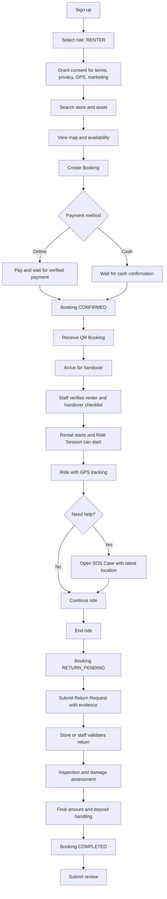
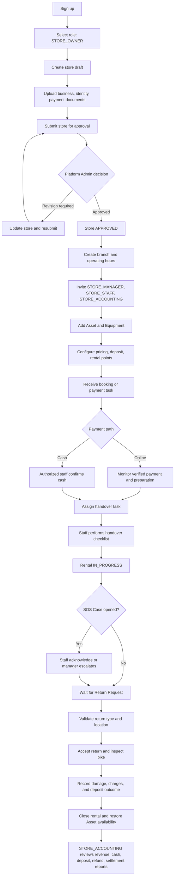
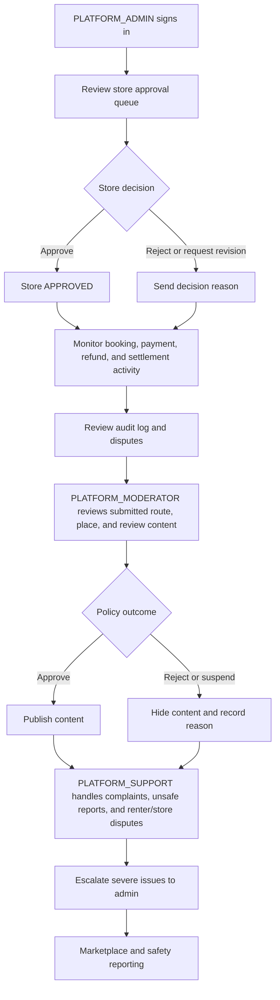

# 00 Project Overview

Source: `docs/Bike-Local-SRS.md` sections 1, 2, 7, 19, 20, 21, 22, 23, 24

## Project Name

Bike Local

## Vision

สร้างระบบ Marketplace และระบบบริหารร้านเช่าจักรยานท้องถิ่นที่รองรับผู้เช่า ร้านค้า พนักงาน และผู้ดูแลแพลตฟอร์ม บน Android, iOS และ Web

## Problem Statement

ผู้เช่าต้องการค้นหา จอง ชำระเงิน รับจักรยาน ปั่น และคืนจักรยานจากร้านท้องถิ่นได้สะดวก ขณะที่ร้านค้าต้องการระบบกลางสำหรับจัดการสาขา จักรยาน อุปกรณ์ พนักงาน การชำระเงิน งานส่งมอบ งานรับคืน รายงาน และความปลอดภัย

## Goals

- รองรับ Cross-platform app และ web portals
- ใช้ Firebase เป็น infrastructure ช่วงเริ่มต้น
- แยก Business Logic ออกจาก Firebase
- ใช้ API Contract เป็นข้อตกลงกลาง
- รองรับหลายร้าน หลายสาขา และหลายพนักงาน
- รองรับ Audit Log, RBAC, Localization ไทย/อังกฤษ
- ออกแบบข้อมูลให้ย้ายไป PostgreSQL หรือ MongoDB ได้

## Non-Goals

- Community Feed ไม่อยู่ในระบบ
- Smart Lock, Smart Dock, GPS/IoT Device, Geofence และ AI Damage Detection อยู่ Phase 2
- Bike Local ไม่ใช่บริการกู้ภัยโดยตรง
- Payment Gateway และ Map Provider ยังไม่ถูกเลือกใน SRS

## Target Users and Personas

| Role | Need |
|---|---|
| Renter | ค้นหา จอง ชำระเงิน ปั่น คืน และดูประวัติ |
| Store Owner | จัดการร้าน สาขา รถ พนักงาน ราคา รายงาน และการจ่ายเงิน |
| Store Manager | บริหารงานประจำวันและมอบหมายพนักงาน |
| Store Staff | ส่งมอบ รับคืน ยืนยันเงินสด ตอบรับ SOS |
| Store Accounting | ตรวจรายรับ เงินสด Settlement และรายงานการเงิน |
| Platform Admin | อนุมัติร้าน ผู้ใช้ ธุรกรรม เนื้อหา และดูภาพรวม |
| Platform Support | จัดการข้อร้องเรียนและข้อพิพาท |

## Roles and Permissions Summary

บทบาทเริ่มต้น: `RENTER`, `STORE_OWNER`, `STORE_MANAGER`, `STORE_STAFF`, `STORE_ACCOUNTING`, `PLATFORM_ADMIN`, `PLATFORM_MODERATOR`, `PLATFORM_SUPPORT`

สิทธิ์ตัวอย่าง: `store.read`, `store.update`, `branch.create`, `asset.create`, `booking.confirm`, `payment.cash.confirm`, `rental.handover`, `return.accept`, `report.financial.read`, `staff.manage`, `sos.location.read`, `content.approve`, `platform.store.suspend`

## Core Modules

- Identity, Users, Stores, Branches, Staff
- Catalog, Inventory, Pricing
- Booking, Payment, Cash, Deposit
- Rental, Ride Tracking, Return
- SOS, Notification
- Routes, Places, Reviews, Moderation
- Reporting, Settlement, Audit

## MVP Scope

### Mobile/Web Application

- Authentication, Role Selection
- Store Search, Map, Asset Search
- Booking, QR Payment, Cash Payment, QR Booking
- Rental Handover, GPS Ride Tracking, Ride Summary
- SOS, Return Request, Return Evidence, History, Review

### Merchant Functions

- Store Registration, Branch Management, Staff Management
- Asset Management, Equipment Management, Pricing, Rental Points
- Booking Management, Payment Verification, Cash Confirmation
- Staff Task, Handover, Return Inspection, Basic Reports

### Admin Portal

- Store Approval, User Management, Transaction Monitoring
- Content Approval, Complaint Management
- Basic Marketplace Reports, Audit Log Search

## Roadmap

1. Foundation: Monorepo, Environment, Authentication, OpenAPI, Error Standard, Logging, Design System, CI/CD, Emulator
2. Core Marketplace: Store, Branch, Staff, Asset, Equipment, Search, Availability, Pricing
3. Transaction: Booking, Payment, Cash, Deposit, Handover
4. Ride and Safety: GPS, Ride Session, Map, SOS, Notification
5. Return: Return Point, Return Request, Staff Pickup, Inspection, Rental Closing
6. Content and Reports: Route, Place, Review, Store Report, Admin Report, Settlement
7. Hardening: Security, Performance, Backup, Monitoring, UAT, Production Launch

## Success Metrics

Source ระบุ acceptance criteria ระดับระบบแทน metric เชิงธุรกิจ:

- ผู้ใช้สมัครและเลือกบทบาทได้
- ร้านสมัครและผ่านการอนุมัติได้
- ผู้ใช้ค้นหาและจองจักรยานได้
- ป้องกันการจองจักรยานซ้ำได้
- รองรับ QR Payment และเงินสด
- บันทึก GPS แบบ offline buffer ได้
- SOS พร้อมพิกัดใช้งานได้
- เงินมัดจำไม่คืนก่อนร้านยืนยันรับคืน
- ทุก action สำคัญมี Audit Log
- Frontend และ Backend ผ่าน Contract Test
- Business Logic ไม่ผูกกับ Firestore SDK

## Risks

| Risk | Mitigation |
|---|---|
| ผูกระบบกับ Firebase มากเกินไป | ใช้ API, Repository และ Adapter |
| ย้ายฐานข้อมูลยาก | ใช้ Canonical Model และ Top-Level Collection |
| Frontend รอ Backend | ใช้ OpenAPI, Mock Server และ Generated Client |
| จองจักรยานซ้ำ | Transaction, Version และ Booking Hold |
| Webhook ซ้ำ | Idempotency และ Payment Event |
| GPS ขาดหาย | Local Buffer และ Track Chunk |
| ข้อมูลข้ามร้าน | Tenant Check ฝั่ง Backend |

## Assumptions

- Payment Gateway จะถูกเลือกภายหลัง
- Map Provider จะถูกเลือกตามราคาและพื้นที่ให้บริการ
- MVP ใช้ GPS โทรศัพท์ ไม่ใช้ GPS ติดจักรยาน
- ร้านรับผิดชอบการให้ความช่วยเหลือหน้างาน
- กฎการยกเลิกและเงินมัดจำกำหนดได้ตามร้านภายใต้นโยบายแพลตฟอร์ม

## Open Questions

- Payment Gateway ที่ต้องใช้คืออะไร
- Map/Geocoding Provider ที่ต้องใช้คืออะไร
- ประเทศ/พื้นที่เปิดให้บริการแรกคือที่ใด
- ต้องรองรับ PDPA/GDPR ในระดับใดและมี retention policy รายละเอียดอย่างไร
- Commission plan และ settlement cycle เริ่มต้นเป็นแบบใด
- UX visual direction และ brand guidelines มีอยู่แล้วหรือไม่

## Open Question Triage

| Topic | Owner | Impact | Next Step | Status |
|---|---|---|---|---|
| Payment Gateway | Product Owner + Engineering | Payment adapter, refund flow, webhook/event design, settlement fee model | Evaluate provider shortlist and record tradeoffs in `05-decisions.md` ADR-006 | Open |
| Map/Geocoding Provider | Product Owner + Engineering | Search quality, map UX, geocoding cost, service-area validation | Compare provider coverage and pricing for launch area before implementation | Open |
| First Launch Area | Product Owner + Operations | Compliance scope, provider choice, language defaults, support model | Confirm first country/city or province set and update rollout assumptions | Open |
| PDPA/GDPR Level and Retention | Product Owner + Legal/Compliance + Security | Consent copy, GPS retention, deletion workflow, support access rules | Turn ADR-012 into a reviewed retention matrix | Open |
| Commission Plan | Product Owner + Finance | Report formulas, net revenue, store contracts | Propose flat or tiered fee model for MVP and record as pending approval | Open |
| Settlement Cycle | Product Owner + Finance + Operations | Payout timing, dispute windows, held settlement handling | Pick provisional cycle for report design and validate with operations | Open |
| Brand Direction | Product Owner + Design | Design tokens, marketing assets, portal styling | Produce a lightweight brand brief before final design tokens | Open |

## MVP User Flow Diagrams

### Renter MVP Flow

Source: `docs/Bike-Local-SRS.md` sections 7.1, 7.2, 7.11-7.25, 19.1, 24; `06-backlog.md` US-001, US-006 to US-015

### Merchant and Staff MVP Flow

Source: `docs/Bike-Local-SRS.md` sections 7.3-7.21, 7.26, 19.2, 24; `06-backlog.md` US-002 to US-014

### Platform Admin, Moderator, and Support MVP Flow

Source: `docs/Bike-Local-SRS.md` sections 7.23-7.29, 19.3, 24; `06-backlog.md` US-002, US-013, US-015

## Policy Boundaries

### Route, Place, and Review Moderation

Source: `docs/Bike-Local-SRS.md` sections 7.23, 7.24, 19.3, 24; `06-backlog.md` US-015

- Route and place submissions from stores or members remain unpublished until `PLATFORM_ADMIN` or `PLATFORM_MODERATOR` approves them.
- Review publication is allowed only after a completed `Booking`; stores may respond, but only platform roles may hide or suspend policy-violating reviews.
- Unsafe, wrong, outdated, duplicate, or clearly irrelevant route/place content should move to review or suspension states instead of remaining publicly visible.
- Content reports from users should create a moderator queue item and audit trail; takedown reasons should be retained for support and dispute follow-up.
- Private ride tracks remain separate from public route/place content by default; no rider GPS history should be auto-published as a route without explicit user action and future product approval.
- Legal questions still open: notice-and-appeal workflow for rejected content, exact evidence retention for moderation actions, and whether store-generated content requires extra business verification in high-risk launch areas.

### Cancellation and Refund

Source: `docs/Bike-Local-SRS.md` sections 7.11, 7.12, 7.26, 7.29, 21, 22; `06-backlog.md` US-007, US-008, US-014

- Stores may define cancellation timing and refund eligibility, but the platform must calculate outcomes from a stored booking policy snapshot and cancellation timestamp.
- Online payment refunds depend on the selected payment gateway, so refund timing, partial refund capability, and fee reversals stay as open provider-dependent questions until ADR-006 is confirmed.
- Cash bookings can be cancelled, but any correction after staff confirmation requires reason capture and audit logging.
- Payment status changes to `PARTIALLY_REFUNDED` or `REFUNDED` only after backend verification, never from client confirmation alone.
- Platform policy assumption for MVP: a cancellation must preserve audit evidence of actor, reason, amount, and policy basis; it does not imply automatic waiver of damage charges or overdue charges discovered before rental close.
- Legal/commercial questions still open: minimum customer notice rules by launch country, whether platform fees are refundable on store-caused cancellations, and whether no-show rules differ for online versus cash bookings.

### Deposit, Return, and Damage Charges

Source: `docs/Bike-Local-SRS.md` sections 7.14, 7.20, 7.21, 7.26, 7.28, 24; `06-backlog.md` US-005, US-012, US-014

- Deposit rules may vary by `Asset`, category, package, or rental duration, but the applied deposit amount must be captured in the booking price/policy snapshot.
- Deposit must remain `PENDING` or `HELD` until return is accepted and inspection is recorded; it must not be released before inspection completes.
- Asset availability returns to `AVAILABLE` only after inspection passes and rental close is complete.
- Damage charges require inspection evidence, charge amount, and inspector identity; disputed damage should keep the booking or return workflow in a reviewable state instead of silently closing.
- Staff pickup returns may add service fees only when disclosed before renter confirmation.
- Commercial/legal questions still open: maximum allowed damage deduction without extra approval, whether stores can charge manual cleaning/late fees in MVP, and required retention periods for return photos and damage evidence.

## Requirement Traceability

| Area | Key Requirement Sources |
|---|---|
| Open question backlog | `00-project-overview.md` Open Questions; `11-tasks.md` Product and Domain checklist; `06-backlog.md` Dependencies |
| Renter MVP flow | `docs/Bike-Local-SRS.md` sections 7.1, 7.2, 7.11-7.25, 19.1, 24; `06-backlog.md` US-001, US-006 to US-015 |
| Merchant/staff MVP flow | `docs/Bike-Local-SRS.md` sections 7.3-7.21, 7.26, 19.2, 24; `06-backlog.md` US-002 to US-014 |
| Admin/moderation/support flow | `docs/Bike-Local-SRS.md` sections 7.23-7.29, 19.3, 24; `06-backlog.md` US-002, US-013, US-015 |
| Moderation boundary | `docs/Bike-Local-SRS.md` sections 7.23, 7.24, 7.29, 19.3, 24 |
| Cancellation/refund boundary | `docs/Bike-Local-SRS.md` sections 7.11, 7.12, 7.26, 7.29, 21, 22 |
| Deposit/return/damage boundary | `docs/Bike-Local-SRS.md` sections 7.14, 7.20, 7.21, 7.26, 7.28, 24 |
