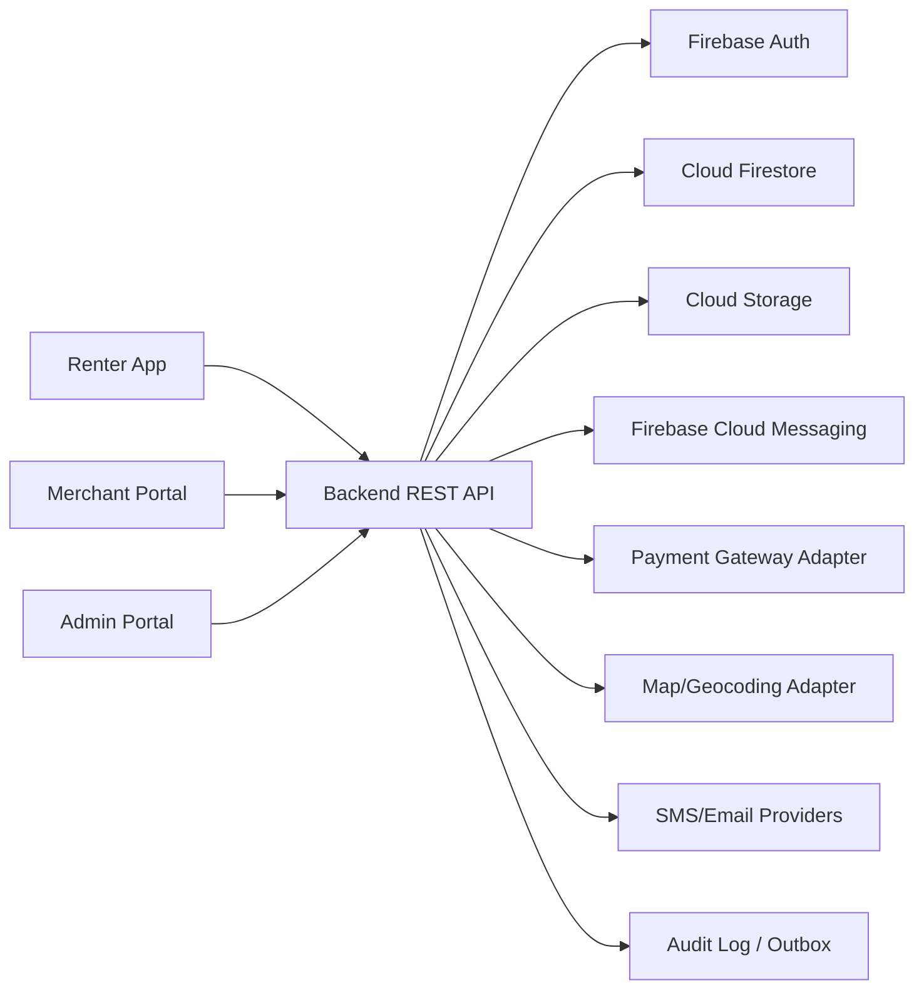

# 01 Architecture

Source: `docs/Bike-Local-SRS.md` sections 3, 4, 5, 6, 10, 11, 12, 13, 15, 16, 17, 25

## Architecture Goals

- Cross-platform frontend สำหรับ Android, iOS และ Web
- Backend API เป็น boundary สำหรับข้อมูลธุรกิจสำคัญ
- Domain/Application Layer ไม่ขึ้นกับ Firebase หรือ Firestore SDK
- Repository Pattern และ Ports and Adapters รองรับ Firestore, PostgreSQL, MongoDB และ In-Memory Adapter
- Contract-First และ API-First เพื่อให้ Frontend/Backend ทำงานขนานกัน
- Serverless-first แต่รองรับ Cloud Run เมื่อเหมาะสม
- Security by role, tenant, branch และ permission

## Proposed Tech Stack

| Area | Choice |
|---|---|
| Mobile/Web app | Flutter, Dart |
| Web portals | Flutter Web หรือ web stack ที่ยังต้องตัดสินใจ แต่ต้องใช้ Generated API Client |
| Backend runtime | TypeScript + Node.js |
| Compute | Firebase Cloud Functions หรือ Google Cloud Run |
| API | REST + OpenAPI 3.1 + JSON Schema |
| Auth | Firebase Authentication + Domain User ID |
| Database MVP | Cloud Firestore |
| Storage | Cloud Storage |
| Messaging | Firebase Cloud Messaging |
| Local data | Local encrypted storage + local database สำหรับ Ride Tracking/Offline Queue |

## System Context



## Request and Data Flow

1. Client authenticates through Firebase Authentication.
2. Client calls Backend API with token and App Check where required.
3. Backend verifies auth token, resolves Domain User ID, tenant/store/branch context, role and permission.
4. Application Service executes use case and calls Domain logic.
5. Repository Interface persists through Infrastructure Adapter.
6. Important changes write Audit Log and Outbox Event.
7. Notifications are sent through FCM, email, or SMS based on event type and preferences.

## Frontend Structure

```text
apps/
├── mobile_app/
├── merchant_portal/
└── admin_portal/

packages/
├── api_client/
├── design_system/
├── domain_models/
├── localization/
├── authentication/
├── maps/
├── notifications/
├── ride_tracking/
├── validation/
└── common_widgets/
```

Presentation Layer ต้องไม่มี Business Rule สำคัญ และต้องใช้ API Client ที่ generate จาก OpenAPI สำหรับ model ที่มีใน contract

## Backend/API Structure

```text
backend/src/
├── identity/
├── users/
├── stores/
├── branches/
├── staff/
├── catalog/
├── inventory/
├── pricing/
├── booking/
├── payment/
├── rental/
├── ride/
├── return/
├── sos/
├── routes/
├── places/
├── reviews/
├── notification/
├── reporting/
├── settlement/
├── moderation/
├── audit/
└── shared/
```

แต่ละ module:

```text
module/
├── domain/
├── application/
├── infrastructure/
├── api/
└── tests/
```

## Data Storage

- MVP ใช้ Cloud Firestore สำหรับ Domain Data, Realtime Status บางส่วน, Notification Inbox, Staff Task และ Configuration
- Cloud Storage ใช้เก็บรูป โปรไฟล์ ร้าน จักรยาน เอกสาร หลักฐานส่งมอบ/คืน รูปความเสียหาย Route Images และ Ride Track Archive
- Business-critical writes ต้องผ่าน Backend
- Top-Level Collections เป็นหลักเพื่อลด vendor lock-in
- Entity สำคัญมี `id`, `schema_version`, timestamps, `tenant_id`, `version`

## Auth and Session Model

- Firebase Authentication รองรับ phone/OTP, email/password, Google Sign-In และ Apple Sign-In ในระยะถัดไป
- Domain User ID แยกจาก Firebase UID
- Custom Claims ใช้ช่วย platform-level role ได้ แต่ store/branch permissions ต้องตรวจจาก Backend
- Sensitive sessions อาจต้อง re-authenticate

## Background Jobs and Events

- ใช้ Outbox สำหรับ event สำคัญที่ต้องส่งซ้ำได้
- Payment Webhook ต้อง retry และ idempotent
- Event สำคัญ: payment completed, staff task assigned, return requested, SOS opened, settlement payment
- Dead Letter หรือ Failure Queue ต้องมีสำหรับ event ที่ประมวลผลไม่สำเร็จ

## Observability

- Structured Logging
- Correlation ID ทุก request
- Error Tracking และ Crash Reporting
- Performance Monitoring
- Business Metrics, Alert และ Dashboard
- ห้าม log password, OTP, payment secret, token เต็ม, เอกสารส่วนบุคคลเต็ม, พิกัดที่ไม่จำเป็น

## Deployment Topology

Environment ขั้นต่ำ:

```text
bike-local-dev
bike-local-staging
bike-local-prod
```

แต่ละ environment ต้องมี Authentication, Firestore, Storage, Functions, FCM, App Check, Remote Config และ Secrets

## Scalability Considerations

เป้าหมายเริ่มต้น:

- 10,000 registered users
- 1,000 concurrent users
- 500 stores
- 2,000 branches
- 10,000 assets/equipment
- 50,000 bookings/month

แนวทาง:

- Batch GPS upload เป็น chunks
- ใช้ cursor pagination
- วาง Firestore indexes ล่วงหน้า
- แยก audit, payment events, booking items, notifications และ ride track chunks ออกจาก nested arrays
- Reporting ซับซ้อนอาจย้ายไป Data Pipeline/Data Warehouse ระยะถัดไป

## Key Tradeoffs

| Decision | Benefit | Tradeoff |
|---|---|---|
| Firebase MVP | เริ่มเร็ว, serverless, auth/storage/FCM ครบ | ต้องระวัง vendor lock-in |
| Backend API only for critical data | Security และ migration control | ต้องสร้าง API ครบก่อนข้อมูลธุรกิจสำคัญ |
| Firestore Top-Level Collections | ย้าย DB ง่ายขึ้น | บาง query ต้องวาง index และ denormalization |
| OpenAPI-first | FE/BE parallel development | ต้องรักษา contract discipline |

## Open Technical Decisions

- เลือก Firebase Cloud Functions หรือ Cloud Run สำหรับแต่ละ backend workload
- เลือก Payment Gateway
- เลือก Map/Geocoding Provider
- เลือก local database สำหรับ Flutter ride tracking/offline queue
- กำหนด event bus/outbox implementation
- กำหนด reporting pipeline สำหรับข้อมูลซับซ้อน
