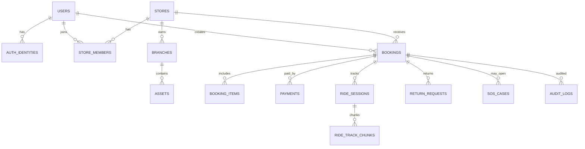

# 03 Database Design

Source: `docs/Bike-Local-SRS.md` sections 4, 6.2, 7, 8, 9, 10.6, 11, 12.5, 12.7, 13, 16.3

## Data Model Overview

MVP ใช้ Cloud Firestore แต่ data model ต้องเป็น canonical domain model ที่ไม่ผูกกับ Firestore document path และต้องรองรับการย้ายไป PostgreSQL หรือ MongoDB

ทุก Entity สำคัญควรมี:

```text
id
schema_version
created_at
created_by
updated_at
updated_by
deleted_at
version
tenant_id
```

## Top-Level Collections

```text
users
auth_identities
stores
branches
store_members
roles
permissions
assets
asset_categories
equipment_items
inventory_units
rental_points
pricing_rules
availability_blocks
bookings
booking_items
payments
payment_events
deposits
rental_sessions
ride_sessions
ride_track_chunks
return_requests
return_inspections
staff_tasks
sos_cases
places
routes
content_submissions
reviews
notifications
settlements
audit_logs
outbox_events
system_configs
```

## Entity Relationship Overview



## Core Schemas

### User

| Field | Type | Notes |
|---|---|---|
| id | string | Domain User ID |
| display_name | string | required |
| phone | string | optional/verified by auth provider |
| email | string | optional |
| photo_url | string | optional |
| locale | string | `th` or `en` |
| country_code | string | optional |
| weight_kg | number | voluntary, used for estimated calories |
| emergency_contact | object | voluntary |
| status | enum | active/suspended/deletion_requested TBD |
| created_at, updated_at | timestamp | UTC |
| version | integer | optimistic concurrency |

### Store

| Field | Type | Notes |
|---|---|---|
| id | string | UUID/domain ID |
| owner_user_id | string | ref users |
| legal_name | string | business/legal name |
| display_name | string | marketplace display |
| description | string | optional |
| status | enum | operational status |
| phone, email | string | contact |
| default_currency | string | e.g. THB |
| timezone | string | required |
| approval_status | enum | see Store Status |
| commission_plan_id | string | TBD |
| created_at, updated_at | timestamp | UTC |
| version | integer | optimistic concurrency |

### Branch

| Field | Type | Notes |
|---|---|---|
| id | string | UUID/domain ID |
| store_id | string | ref stores |
| name | string | required |
| address | string | required |
| province, district, country | string | search/filter |
| latitude, longitude, geohash | location | map/search |
| phone | string | contact |
| opening_hours | object | structured hours |
| status | enum | ACTIVE, TEMPORARILY_CLOSED, INACTIVE |
| created_at, updated_at | timestamp | UTC |
| version | integer | optimistic concurrency |

### Asset

| Field | Type | Notes |
|---|---|---|
| id | string | UUID/domain ID |
| store_id, branch_id | string | refs |
| category_id | string | ref asset_categories |
| code | string | unique within store |
| qr_token_reference | string | no raw long-lived token |
| brand, model, color, size | string | catalog |
| description | string | optional |
| status | enum | see Asset State |
| base_price | integer | minor unit |
| deposit_amount | integer | minor unit |
| currency | string | required |
| current_point_id | string | ref rental_points |
| gps_device_id, smart_lock_id | string | Phase 2 |
| created_at, updated_at | timestamp | UTC |
| version | integer | optimistic concurrency |

### Booking

| Field | Type | Notes |
|---|---|---|
| id | string | UUID/domain ID |
| booking_number | string | human/reference number |
| user_id, store_id, branch_id | string | refs |
| status | enum | see Booking State |
| start_at, end_at | timestamp | UTC |
| pickup_point_id, return_point_id | string | refs |
| payment_method | enum | online/cash TBD |
| currency | string | required |
| subtotal_amount, fee_amount, deposit_amount, discount_amount, total_amount | integer | minor unit |
| price_snapshot, policy_snapshot | object | immutable snapshot |
| created_at, updated_at | timestamp | UTC |
| version | integer | optimistic concurrency |

### Payment

| Field | Type | Notes |
|---|---|---|
| id | string | UUID/domain ID |
| booking_id, user_id, store_id | string | refs |
| provider | string | TBD |
| provider_reference | string | external ref |
| method | enum | gateway/cash/etc TBD |
| status | enum | PENDING, PROCESSING, PAID, FAILED, EXPIRED, PARTIALLY_REFUNDED, REFUNDED, DISPUTED |
| amount | integer | minor unit |
| currency | string | required |
| idempotency_key | string | required for important commands |
| paid_at | timestamp | optional |
| confirmed_by | string | staff/admin/system |
| created_at, updated_at | timestamp | UTC |
| version | integer | optimistic concurrency |

### Ride Session and Track Chunk

Ride Session เก็บ summary และ reference ส่วน Track Chunk เก็บ GPS chunks พร้อม checksum เพื่อรองรับ offline/batch upload และการย้าย payload ขนาดใหญ่ไป Cloud Storage

### Audit Log

| Field | Type | Notes |
|---|---|---|
| id | string | UUID/domain ID |
| tenant_id | string | optional for platform/system actions |
| actor | object | actor type, domain user id, firebase uid reference, role snapshot, hashed IP, user agent |
| action | string | e.g. `payment.cash.confirmed`, `permission.changed` |
| resource_type | string | aggregate or bounded-context resource name |
| resource_id | string | target entity id |
| before, after | object | sanitized snapshots only; no raw token, OTP, full document, or unnecessary coordinates |
| reason | string | required for staff/admin corrections, suspension, refund, and overrides |
| classification | enum | `INTERNAL`, `CONFIDENTIAL`, `SENSITIVE_LOCATION`, `FINANCIAL` |
| correlation_id | string | request trace id |
| occurred_at | timestamp | UTC |
| immutable | boolean | always `true`; append-only storage |

## Status and Enums

### Store Approval

`DRAFT`, `SUBMITTED`, `UNDER_REVIEW`, `REVISION_REQUIRED`, `APPROVED`, `REJECTED`, `SUSPENDED`, `CLOSED`

### Asset

`AVAILABLE`, `RESERVED`, `PREPARING`, `AWAITING_HANDOVER`, `RENTED`, `RETURN_PENDING`, `INSPECTION_PENDING`, `MAINTENANCE`, `INACTIVE`, `LOST`

### Booking

`PENDING_PAYMENT`, `PENDING_STORE_CONFIRMATION`, `CONFIRMED`, `PREPARING`, `AWAITING_PICKUP`, `IN_PROGRESS`, `RETURN_PENDING`, `INSPECTION_PENDING`, `COMPLETED`, `CANCELLED`, `NO_SHOW`, `DISPUTED`

### Return Request

`REQUESTED`, `VALIDATING_LOCATION`, `WAITING_FOR_STORE`, `STAFF_ASSIGNED`, `PICKUP_IN_PROGRESS`, `INSPECTION_PENDING`, `ACCEPTED`, `REJECTED`, `DISPUTED`, `CANCELLED`

### SOS

`OPEN`, `ACKNOWLEDGED`, `ASSIGNED`, `IN_PROGRESS`, `RESOLVED`, `CLOSED`

## Indexes and Constraints

- `assets`: unique `(store_id, code)`
- `bookings`: query by `store_id`, `branch_id`, `user_id`, `status`, `start_at`, `end_at`
- Availability checks must prevent overlapping confirmed bookings for same asset/time range
- `ride_track_chunks`: unique `(ride_session_id, sequence)`
- `payments`: unique idempotency key per command context
- `audit_logs`: append-only by `resource`, `resource_id`, `actor`, `timestamp`
- Geospatial search requires geohash or provider-specific index

## Migration Strategy

1. Schema Mapping
2. Full Data Export
3. Data Transformation
4. Referential Integrity Validation
5. Historical Data Import
6. Incremental Change Capture
7. Dual Write ชั่วคราวหากจำเป็น
8. Read Comparison
9. Cutover
10. Rollback Plan
11. Post-Migration Audit

## PostgreSQL Notes

- Top-Level Collection แปลงเป็น table
- Reference ID แปลงเป็น foreign key
- Booking Item เป็น child table
- Store Member เป็น join table
- Route/Place ใช้ PostGIS ได้
- GPS Track ใช้ Geometry หรือ time-series table ได้
- Booking concurrency ใช้ transaction และ row lock

## MongoDB Notes

- Top-Level Collection คงรูปแบบใกล้ Firestore
- Reference สำคัญเก็บ ID ชัดเจน
- หลีกเลี่ยง document ขนาดใหญ่
- Ride Track แยก chunk
- Payment Event และ Audit Log แยก collection

## Backup and Restore

- ต้องมี backup ตามรอบเวลา
- MVP RPO ไม่เกิน 24 ชั่วโมงสำหรับข้อมูลทั่วไป
- ข้อมูลธุรกรรมสำคัญต้องมี event/audit แยก
- MVP RTO ไม่เกิน 8 ชั่วโมง
- ต้องทดสอบ restore ตามรอบที่กำหนด

## Data Privacy Notes

- Background Location ต้องขอ consent ชัดเจน
- ร้านเห็นตำแหน่งผู้เช่าเฉพาะกรณีจำเป็น: rental active, return request, SOS
- ต้องกำหนด retention ของ GPS track
- ข้อมูลส่วนบุคคลต้องแยกจากรายงานเชิงสถิติเท่าที่ทำได้
